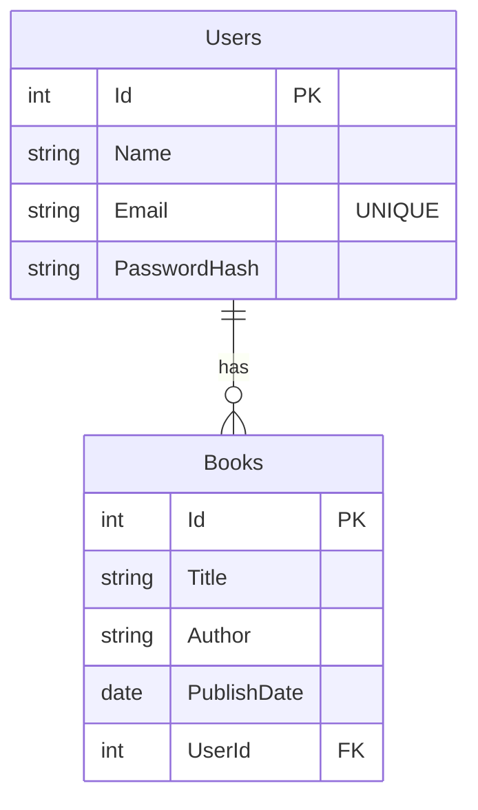
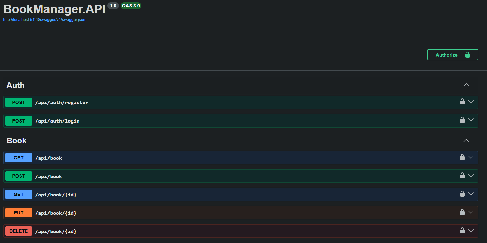
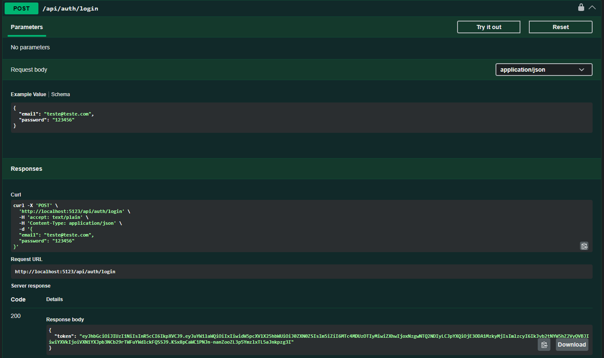
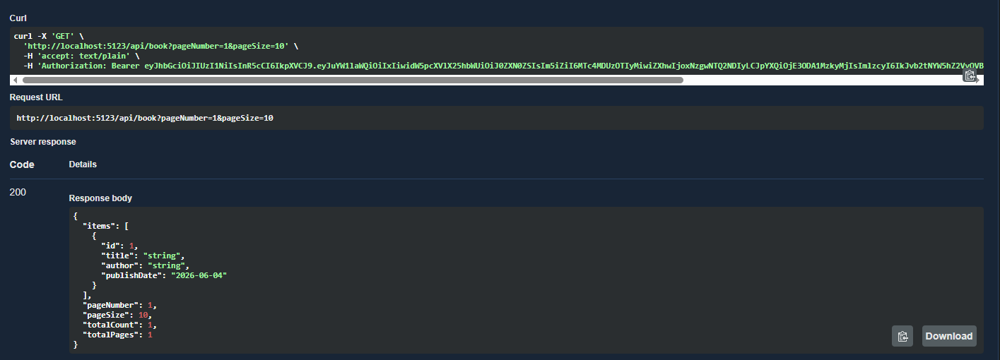
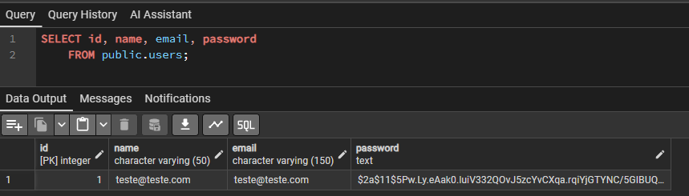

# Book Manager API

Este projeto é um teste prático desenvolvido para demonstrar competências, focando em boas práticas, arquitetura escalável e conteinerização. A aplicação consiste em um CRUD de Livros, com autenticação, paginação e persistência de dados.

## 🏗️ Arquitetura e Tecnologias
- Construído com uma arquitetura em camadas (Controller -> Service -> Repository).
- **Framework:** .NET 10.0.
- **ORM:** Entity Framework Core com FluentAPI para mapeamento detalhado de entidades.
- **Banco de Dados:** PostgreSQL
- **Segurança:** Autenticação baseada em JWT (JSON Web Tokens) e criptografia de senhas com BCrypt.Net.
- **Mapeamento:** Uso de Mapeamento Manual (DTOs), sem o AutoMapper, garantindo maior controle e performance.
- **Validação:** FluentValidation para garantir a integridade dos dados de entrada.
- **Documentação:** Swagger/OpenAPI configurado com suporte a JWT para testes de endpoints.
- **Testes:** xUnit, NSubstitute (Mocking), FluentAssertions e Testcontainers (banco de dados real para integração).

## 📂 Estrutura de Pastas

```text
BookManager/
├── BookManager.API/
│   ├── Controllers/       # Endpoints REST (AuthController, BookController)
│   ├── Data/              # Contexto do banco de dados (AppDbContext) e mapeamentos
│   ├── DTOs/              # Objetos de Transferência de Dados (Request/Response)
│   ├── Migrations/        # Histórico de alterações do banco de dados (EF Core)
│   ├── Models/            # Entidades de domínio (User, Book)
│   ├── Repositories/      # Padrão Repository para acesso ao banco
│   ├── Services/          # Regras de negócio da aplicação
│   └── Validators/        # Regras de validação (FluentValidation)
│
├── BookManager.Tests/     # Projeto de testes (Unitários e de Integração)
│   ├── Integration/       # Testes com banco real via Testcontainers
│   └── Services/          # Testes unitários com NSubstitute
│
├── docker-compose.yaml    # Orquestração de containers (API, Postgres, pgAdmin)
└── BookManager.slnx       # Arquivo da Solução
```

## 📊 Esquema do Banco de Dados (UML/ER)



## 📸 Demonstração

### Swagger
 


### Login 
 

### Using Token
 

### DB: user (encrypted password)
 


## Esquema de Testes
A aplicação possui uma suíte completa de testes garantindo sua confiabilidade:
- **Unitários:** Focados na camada de `Services`, isolando dependências através de mocks (`NSubstitute`). Ex: Validação de regras de negócio como impedir o cadastro de livros com títulos duplicados para um mesmo usuário.
- **Integração:** Realizados na subpasta `Integration`, utilizando `Testcontainers` (PostgreSQL) e `WebApplicationFactory` para testar os endpoints de ponta a ponta. Cenários testados:
  - Registro de usuário e geração de token.
  - Bloqueio de acesso sem token (401 Unauthorized).
  - Bloqueio ao tentar deletar livros de terceiros (404 Not Found).
  - Listagem paginada e validada de livros.

## 🚀 Como Executar
O projeto está totalmente dockerizado, o que facilita a execução em qualquer ambiente.

### Pré-requisitos
- Git
- Docker e Docker Compose
- .NET 10.0 SDK (Opcional, apenas se quiser rodar local sem docker)

### Passo a Passo 

1. **Clone o repositório:**
```bash
git clone https://github.com/G4brielV/BookManager.git
cd BookManager
```

2. **Suba os containers:**
```bash
docker-compose up -d --build
```

### URLs de Acesso:
- **Swagger (Backend):** [http://localhost:5123/swagger/index.html](http://localhost:5123/swagger/index.html) (Documentação da API e testes manuais).
- **pgAdmin:** [http://localhost:5050/](http://localhost:5050/) (Gerenciamento visual do banco PostgreSQL).
  - *Login:* admin@admin.com
  - *Senha:* admin

### 🧪 Rodar Testes:
Para rodar a suíte de testes unitários e de integração na sua máquina, execute na raiz do projeto:

```bash
# Executa todos os testes (subirá um container Postgres temporário para os de integração)
dotnet test

# Se quiser rodar apenas os testes unitários:
dotnet test --filter "FullyQualifiedName~Services"

# Se quiser rodar apenas os testes de integração:
dotnet test --filter "FullyQualifiedName~Integration"
```
